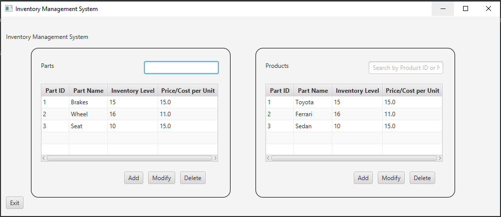
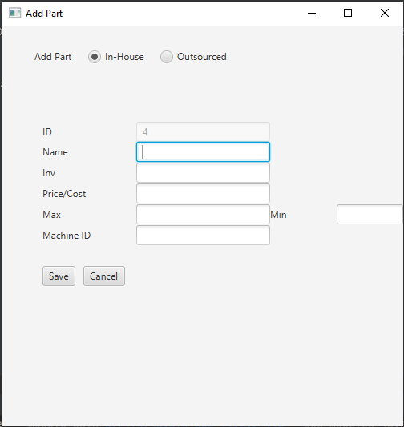
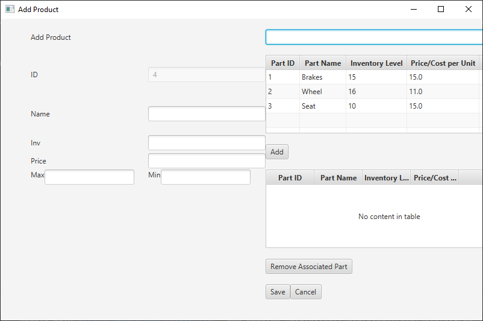

### Software 1 Assignment - Western Governors University

Result: Perfect Score

Compiles on Windows 10, have not tested on MacOS, but as IntelliJ works on MacOS and Java is system independent, I think it should work on Mac or Linux as well. 

WGU is an accredited university, however, when reading my score report it is worth nothing that WGU does not use the GPA system.
It uses its own system of what are called Competencies. I got a perfect score on this assignment so that distinction is not as importa
nt here, but that will explain why you see "Competent" over and over in the score report instead of a GPA score.

I've included 2 pdf files that show the assignment prompt and my score as well as a UML Diagram of the program structure.

A video walkthrough of my finished assignment can be found [here](https://youtu.be/BLtePhuMjMU).

### Specs:
This project uses jdk-11.0.12 for the Java SDK, and javafx-sdk-11.0.2 for the JavaFX Library. 
JavaFX is an open source library that is basically used for front-end GUI elements. 
In order to future-proof this repo, I have included both sdks in the repo itself.
I used git lfs to push these up to git. 

